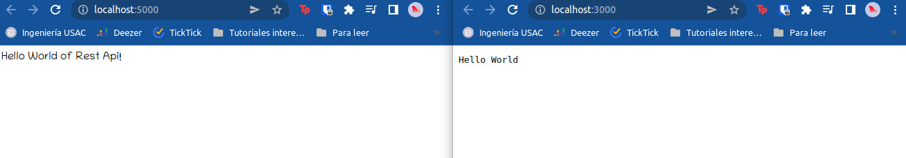

# DevOps App

Steps to make a DevOps Application and Automation

# Prerequisites

We'll use docker to test in a local environment, so we need to install the tools to run [Docker](https://www.docker.com/) and [Docker-Compose](https://docs.docker.com/compose/), also need to install [Python3](https://www.python.org/) and [NodeJs](https://nodejs.org/en/).

## Step 1 - Installing docker

Follow the first two steps of [How to install and use Docker on Ubuntu 20.04](https://www.digitalocean.com/community/tutorials/how-to-install-and-use-docker-on-ubuntu-20-04).

## Step 2 - Install docker-compose

We can check the latest version of Docker Compose in its official [Github repository](https://github.com/docker/compose) and check the [version page](https://github.com/docker/compose/releases). At the time of this writing, the latest stable version is [2.4.1](https://github.com/docker/compose/releases/tag/v2.4.1).

The following command will download the version 2.4.1:

```shell
sudo curl -L "https://github.com/docker/compose/releases/download/v2.4.1/docker-compose-$(uname -s)-$(uname -m)" -o /usr/local/bin/docker-compose
```

Next, we will set the correct permissions to make the command `docker-compose` executable:

```shell
sudo chmod +x /usr/local/bin/docker-compose
```

To verify that the installation was successful, you can run:

```shell
docker-compose --version
```

You'll see an output like this: 

```shell
Docker Compose version v2.4.1
```

## Step 3 - Install python and pip

Ubuntu 20.04 and other Debian Linux based version already have Python3 installed, let's check with:

```shell
python3 -V
```

You should see something like:

```shell
Python 3.8.10
```

To install pip you need to type this:

```shell
sudo apt install python3-pip
```

## Step 4 - Install NodeJs

Install Node.js with:

```shell
sudo apt install nodejs
```

In most cases, you’ll also want to also install npm, the Node.js package manager. You can do this by installing the npm package with apt:

```shell
sudo apt install npm
```

# Python app

Let's do some code to test docker and how will be deployed

## Step 1 - Install virtualenv (Virtual Environment for Python3)

*NOTE: Skip this step if you have already installed virtualenv*

Then install virtualenv using pip3:

```shell
sudo pip3 install virtualenv 
```

## Step 2 - Virtual environment creation

Inside the `python-app` folder of this repo is a small app for a REST API, so first we need to make a virtualenv to encapsulate the libraries from the global python environment.

It's important that is in a separate folder and not in the root to separate from the rest of the project containers when we do a docker-compose orchestration. Go to the `python-app` folder or create a new one:

```shell
cd python
```

Create a virtual environment:

```shell
python3 -m virtualenv venv
```

A new folder should have been created called `venv`

First we need to activate the virtual environment:

```shell
source venv/bin/activate
```

**NOTE: To quit from the virtual environment you need to type in terminal `deactivate`.**

## Step 3 - Flask app and requirements.txt

Then let's make some code for a Flask app, in the file `app.py` is a small code to run a Rest api using Flask. 

We need to install the necessary libraries to correcly run the App:

```shell
pip install flask flask-cors
```

If everything is ok, we can run the app locally using python:

```shell
python app.py
```

You should see and output like this:

```shell
 * Serving Flask app 'app' (lazy loading)
 * Environment: production
   WARNING: This is a development server. Do not use it in a production deployment.
   Use a production WSGI server instead.
 * Debug mode: off
 * Running on all addresses (0.0.0.0)
   WARNING: This is a development server. Do not use it in a production deployment.
 * Running on http://127.0.0.1:5000
 * Running on http://192.168.1.5:5000 (Press CTRL+C to quit)
```

Let's try in browser:


Then we need to extract the requirements.txt to install them automatically in the Docker-compose's container. Close the app pressing CTRL+C to quit, then:

```shell
pip freeze > requirements.txt
```

A file should have been created called `requirements.txt` with all the required libraries.

## Step 4 - Docker preparations

Let's create a Docker file to make an image of the python app. You can see a [Dockerfile](./python-app/Dockerfile) in the `python-app` folder with comments explaining each line.

```Dockerfile
# ./python-app/Dockerfile
FROM python:3.8 
ADD . /code
WORKDIR /code
RUN pip install -r requirements.txt
CMD python app.py
```

*NOTE: It's important that the file is called `Dockerfile` exactly.*

Then create docker-compose file **in the ROOT of the project**. You can see a [docker-compose file](./docker-compose.yaml) in the root folder with comments explaining each line.

```yaml
flask-app:
  build: python-app/. # name of the folder
  container_name: flask-app # name of the container
  ports:
    - "5000:5000" # host port : container port
  volumes:
    - .:/flask/code # save data in a volume
  networks: 
    app_net:
      ipv4_address: 172.19.0.2 # ip address of the container to communicate from other containers
```

*NOTE: It's important that the file is called `docker-compose.yaml` exactly*

## Step 5 - local tests

Let's test the docker compose to run the image of python using this command in the root of the folder

```shell
docker-compose up -d --build
```

- **docker-compose**: the docker compose CLI.
- **up**: run the projects
- **-d**: make the containers run as a background process
- **--build**: build the images using docker

The app should be running as a background process. Let's see in the browser:


You can also see if the image is running with the command:

```shell
docker ps
```

You should see an output like this to see the data of the running containers:

```shell
CONTAINER ID   IMAGE                 COMMAND                  CREATED         STATUS         PORTS                                       NAMES
38bc6b1c4728   devopsapp_flask-app   "/bin/sh -c 'python …"   4 minutes ago   Up 4 minutes   0.0.0.0:5000->5000/tcp, :::5000->5000/tcp   flask-app
```

We can turn off the docker containers using this command:

```shell
docker-compose down
```

# Javascript

## Step 1 - Start a Node project

Create the file app.js to start creating the Node project with this code to create a simple server:

```js
// ./javascript-app/app.js
const http = require('http');

const hostname = '0.0.0.0';
const port = 3000;

const server = http.createServer((req, res) => {
  res.statusCode = 200;
  res.setHeader('Content-Type', 'text/plain');
  res.end('Hello World');
});

server.listen(port, hostname, () => {
  console.log(`Server running at http://${hostname}:${port}/`);
});
```

Then start the node package with:

```shell
node init
```

And let's finish the process of preparation with:

```shell
npm install
```

Finally, run the project with:

```shell
node app.js
```

And the app should output something like this:

```shell
Server running at http://127.0.0.1:3000/
```

Check the browser at that direction:


It's working like a charm.

## Step 2 - Dockerize the Node project

Let's create a Docker file to make an image of the python app. You can see a [Dockerfile](./javascript-app/Dockerfile) in the `javascript-app` folder with comments explaining each line.

```Dockerfile
# ./javascript-app/Dockerfile
FROM node:12
RUN mkdir /app
WORKDIR /app
COPY . /app
RUN npm i
CMD node app.js
```

*NOTE: It's important that the file is called `Dockerfile` exactly.*

Then edit the docker-compose file **in the ROOT of the project**. You can see a [docker-compose file](./docker-compose.yaml) in the root folder with comments explaining each line.

```yaml
node-app:
  build: javascript-app/. # name of the folder where the Dockerfile is
  container_name: node-app # name of the container
  ports:
    - "3000:3000" # host port : container port
  volumes:
    - .:/node/app # save data in a volume
  networks: 
    app_net:
      ipv4_address: 172.19.0.3 # ip address of the container to communicate from other containers
```

*NOTE: It's important that the file is called `docker-compose.yaml` exactly*

## Step 3 - local tests

Let's test the docker compose to run the image of both apps using the previos command in the root of the folder

```shell
docker-compose up -d --build
```

The apps should be running at the same time as a background process. Let's see in the browser for both apps:



You can also see if the image is running with the command:

```shell
docker ps
```

You should see an output like this to see the data of the running containers:

```shell
CONTAINER ID   IMAGE                 COMMAND                  CREATED         STATUS         PORTS                                       NAMES
72500f958704   devopsapp_flask-app   "/bin/sh -c 'python …"   2 minutes ago   Up 2 minutes   0.0.0.0:5000->5000/tcp, :::5000->5000/tcp   flask-app
977465d7508d   devopsapp_node-app    "docker-entrypoint.s…"   2 minutes ago   Up 2 minutes   0.0.0.0:3000->3000/tcp, :::3000->3000/tcp   node-app
```

We can turn off the docker containers using this command:

```shell
docker-compose down
```

# Github Actions

## Step 1 - Create a workflow

Create a `.github/workflows` directory in your repository on GitHub if this directory does not already exist.

In the `.github/workflows directory`, create a file named `github-actions.yml`.

Edit the file you just created and type this:

```yaml
name: GitHub Actions
on: [push]
jobs:
  build:
    runs-on: ubuntu-latest
    steps:
      - run: ls -l
      - run: docker-compose build
  deploy:
    runs-on: ubuntu-latest
    steps:
      - run: docker-compose up -d
```

